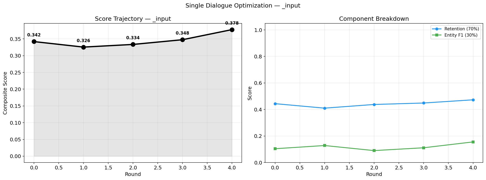
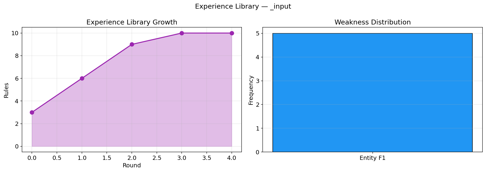

# Iterative Memory Optimization via Self-Comparison

通过多轮自我对比迭代，在不重新训练 LLM 的前提下提升文本摘要 / 记忆文档的生成质量。

借鉴 [3DrawAgent](https://arxiv.org/abs/2604.08042) 的"对比知识提取"(CKE) 范式：

```
生成 K 个候选 → AutoMemo 评分排序 → 裁判对比高低分 → 提取通用写作规则 → 注入下一轮 prompt
```

## 效果演示

运行一条用户输入后，输出两张图表：

| 得分轨迹 | 经验库增长 |
|---------|----------|
|  |  |

- **左图**：Composite 得分（黑线）随轮次变化，Retention（蓝）+ Entity F1（绿）走势
- **右图**：经验库规则数量增长（紫线）+ 短板分布（柱状图）

## 快速开始

### 1. 环境

```bash
pip install -r requirements.txt
python -m spacy download en_core_web_sm
```

### 2. 模型（从 Gitee 镜像，约 2GB）

```bash
mkdir -p local_models
git clone https://gitee.com/hf-models/all-MiniLM-L6-v2.git local_models/all-MiniLM-L6-v2
git clone https://gitee.com/hf-models/roberta-large-mnli.git local_models/roberta-large-mnli
```

### 3. API Key

```bash
cp .env.example .env
```

编辑 `.env` 填入 DeepSeek API Key（支持生成和裁判使用不同 Key）：

```
OPENAI_API_KEY=sk-your-key-here
OPENAI_BASE_URL=https://api.deepseek.com/v1
JUDGE_API_KEY=sk-your-judge-key-here
```

### 4. 运行

```bash
python server.py        # Web 界面（推荐）
# 或
python main.py --mode test     # 命令行：5 条内置对话
python main.py --mode user --text "..."    # 命令行：单条输入
```

## 使用方式

### Web 界面（双击 `start.bat` 或 `python server.py`）

- **Test 模式**：对 5 条内置英文对话运行优化
- **User 模式**：粘贴文本或拖拽上传文件（PDF / PPTX / DOCX / CSV / JSON / XML / TXT / MD）
- 实时日志流式展示，完成后自动加载结果面板

### 命令行

```bash
python main.py --mode test                         # 测试模式
python main.py --mode user --text "对话文本..."      # 直接输入
python main.py --mode user --file document.pdf     # 从文件读取
python main.py --dry-run                           # 只测评分器
python main.py --mock-llm                          # 离线快速验证
```

可选参数：`--rounds 5` `--candidates 5` `--model deepseek-chat`

## 评分机制

| 维度 | 权重 | 方法 | 测量内容 |
|------|------|------|---------|
| Retention | 70% | MiniLM 嵌入余弦相似度 | 记忆覆盖了原文中多少信息 |
| Entity F1 | 30% | spaCy NER 实体匹配 | 人名、数字、日期等关键事实是否丢失 |

评分器称为 **AutoMemo**，综合嵌入语义覆盖和实体完整性两个维度。

## 核心机制

### 迭代优化循环

每轮包含五个阶段：

```
Phase 1 — 生成 K 个候选（温度退火 0.8→0.3）
Phase 2 — AutoMemo 评分排序
Phase 3 — 裁判 LLM 对比高低分，提取领域无关的通用写作规则（最多 5 条）
Phase 4 — 检测弱点（Retention/Entity F1 哪个更低），下一轮针对性注入规则
Phase 5 — 规则入经验库：ADD（≤3 条/轮）+ KEEP（存活计数）+ DELETE（淘汰负分）+ MODIFY（合并相似）
```

### 经验库四操作

| 操作 | 触发 | 作用 |
|------|------|------|
| ADD | 每轮裁判产规则后 | 最多 3 条入库，语义去重 |
| KEEP | 每轮结束 | 所有规则 usage_count += 1，活得越久越难被删 |
| DELETE | 每轮结束 | 存活 ≥ 2 轮且 score_delta < 0 的规则被淘汰 |
| MODIFY | 库满 10 条时 | 相似规则（cos > 0.75）合并，保留高分 |

### 温度退火

参考论文设定：Round 0 用 T=0.8 探索多样性，逐轮降至 Round 4 用 T=0.3 精准生成。

## 输出结构

```
output/
├── test/                             # 测试模式（5 条对话）
│   ├── results.json                  # 完整得分数据 + 最佳记忆
│   ├── results_experiences.json      # 每条对话独立学到的规则
│   ├── score_trajectory.png          # 五色线：各对话得分轨迹
│   ├── component_breakdown.png       # 六面板：Retention/Entity F1 分解
│   ├── experience_growth.png         # 经验库规则数量增长
│   └── weakness_distribution.png     # 各维度短板频率
│
└── user/                             # 用户模式（单条对话）
    ├── results.json
    ├── trajectory.png                # 得分轨迹 + 组件分解
    └── library.png                   # 规则增长 + 短板分布
```

## 项目结构

```
├── server.py            # Web 界面入口（Flask + SSE）
├── main.py              # 命令行入口
├── config.py            # 配置文件
├── start.bat            # Windows 一键启动
├── _ssl_patch.py        # SSL 证书修复（受限网络用）
├── evaluator/
│   ├── automemo.py      # AutoMemo 评分器（嵌入 + NLI）
│   └── ner.py           # 实体抽取（spaCy）
├── generator/
│   ├── llm_client.py    # LLM API 客户端（OpenAI 兼容，并行请求）
│   ├── prompts.py       # Prompt 模板（生成 / 裁判 / 经验注入）
│   └── mock_llm.py      # 假 LLM（离线测试用）
├── experience/
│   └── library.py       # 经验库（ADD/DELETE/MODIFY/KEEP + 进化追踪）
├── optimizer/
│   ├── iterator.py      # 核心迭代循环（温度退火 + 弱点驱动注入）
│   └── judge.py         # 裁判 LLM（对比 + 解析规则）
├── visualizer/
│   └── plotting.py      # matplotlib 图表（5 种）
├── utils.py             # 工具函数（文件解析/种子/日志）
├── data/
│   ├── dialog_data.py   # 数据集加载器
│   └── samples/         # 测试样本（英文翻译版）
├── local_models/        # 本地模型（需自行下载）
├── output/              # 输出结果（test/ user/）
└── assets/              # README 示例图表
```

## 常见问题

**Q: 直接输入中文可以吗？**
评分组件（MiniLM / spaCy）均为英文模型，中文输入评分不准。建议先翻译为英文再输入，或将模型替换为多语言版本。

**Q: 运行很慢怎么办？**
瓶颈在 LLM API 延迟，不是本地评分。主要耗时在每轮的 5 次生成调用 + 1 次裁判调用。

**Q: Rules 一直为 0？**
检查 `.env` 中 API Key 是否正确。Key 无效时会自动回退到 mock LLM（无 API 调用但输出无意义）。

**Q: 支持哪些文件格式？**
PDF、PPTX、DOCX、CSV、JSON、XML、TXT、MD。Web 界面拖拽上传自动提取文字。

## 分支说明

| 分支 | 内容 |
|------|------|
| `main` | 主干：对话记忆优化 + Web 界面 |
| `study-notes` | 上课笔记模式（`--mode study`） |
| `rule-evolution` | 规则演化追踪 + 温度退火（已合并） |

## 参考

- [3DrawAgent](https://arxiv.org/abs/2501.09153) — 对比知识提取（CKE）+ 经验库迭代
- AutoMemo — 本项目内置评分器，综合嵌入语义覆盖 + 实体完整性评估
